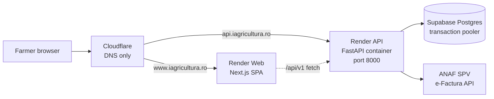
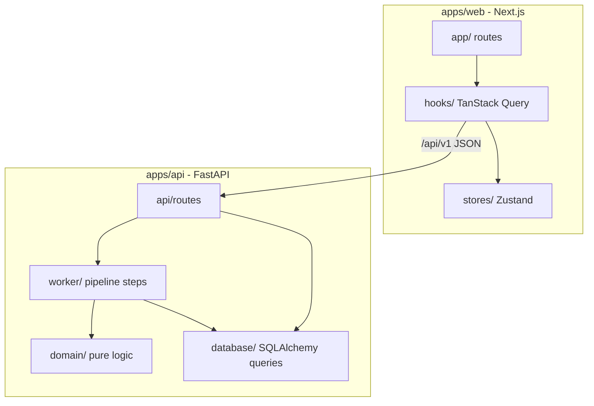

# Architecture

One-page overview of how Farm Copilot is structured and deployed.
Deeper detail lives in [`docs/02_architecture.md`](docs/02_architecture.md) and
[`apps/api/docs/ARCHITECTURE.md`](apps/api/docs/ARCHITECTURE.md).

---

## Deployment topology



The frontend is a stateless SPA. The backend is a single long-running container
(it can also host the periodic ANAF auto-sync scheduler; disabled in the demo
deploy). The database is managed by Supabase. Cloudflare is the DNS host;
Render terminates TLS and deploys both apps from `main` via `render.yaml`.

---

## Code structure



### Layer responsibilities

| Layer | Belongs in | Must not contain |
|---|---|---|
| `apps/api/src/farm_copilot/api/` | Request parsing, auth dependency, response shaping | Business logic |
| `apps/api/src/farm_copilot/worker/` | Pipeline orchestration, persistence side-effects | Pure rules without persistence |
| `apps/api/src/farm_copilot/domain/` | Deterministic business rules, value objects | Database, HTTP, OCR vendor SDKs |
| `apps/api/src/farm_copilot/database/` | SQLAlchemy queries, migrations | Domain decisions |
| `apps/web/src/app/` | Page composition, layouts | Server-side business logic |
| `apps/web/src/hooks/` | Data fetching, TanStack Query | UI rendering |

---

## The invoice pipeline (canonical order)

```
upload
  -> OCR / XML extraction
  -> line extraction
  -> product normalization
  -> benchmark comparison
  -> invoice anomaly detection
  -> stock-in update            (only after non-blocking validation)
  -> alert generation
  -> explanation trail
  -> human correction loop      (re-enters from normalization)
```

Stock-in writes only when the pipeline reaches that step successfully.
If the invoice halts at `needs_review` before stock-in, no movements are recorded
until the user resolves review and the pipeline resumes.

Alerts always reference pipeline events; they do not replace the audit log.
