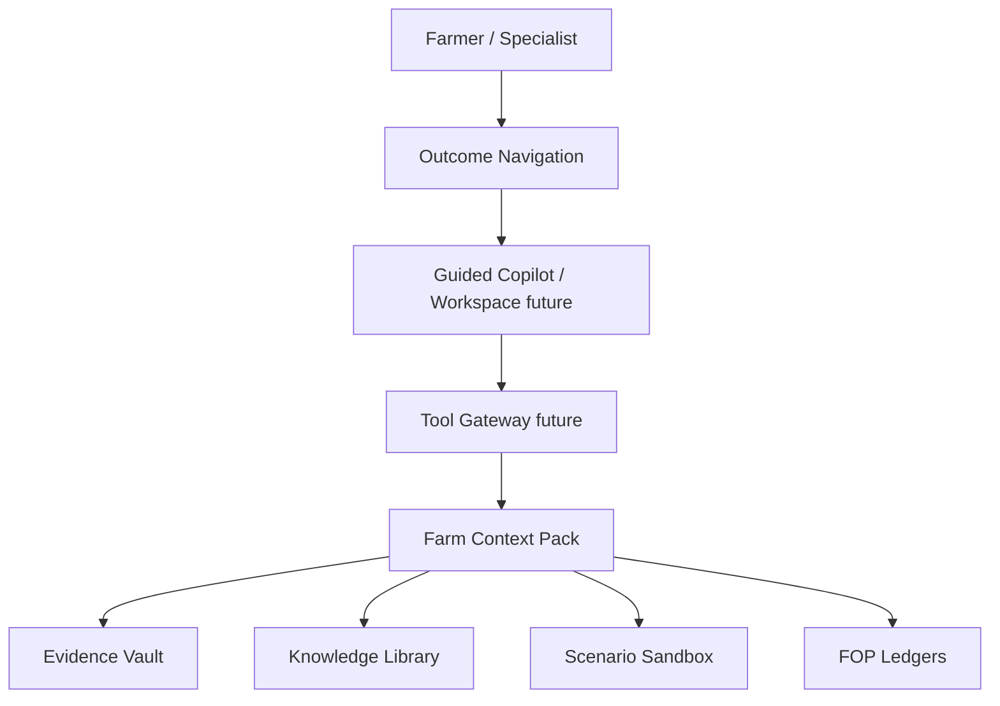

# AgroUnu — AI Engineering Case Study

## 1. Problem

Romanian farmers face a deeply fragmented operational landscape. They deal with disconnected records, massive funding complexity, intense input cost pressure, weak selling power, knowledge gaps, and high-risk decisions. 

Initial farmer discovery showed that farmers care most about practical outcomes, not technology for the sake of technology:
- Securing funding
- Buying inputs cheaper
- Selling harvests better
- Accessing practical agronomic knowledge
- Managing documents efficiently
- Leveraging cooperative networks
- Reducing overall operational risk

## 2. Core AI Engineering Challenge

How can an AI assistant guide farmers safely in a complex, regulated, and uncertain domain without hallucinating, over-automating, or making risky claims? 

Building an AI for agriculture is not a text-generation problem; it is a **safety, context, and evidence** problem. If an AI hallucinates an agronomic prescription or incorrectly guarantees funding eligibility, the consequences are severe.

## 3. My Role

**Founder, AI Architect, and Technical Lead.**

In this project, I owned and executed:
- Product Strategy
- AI Architecture
- Domain Modeling
- Prompt Architecture
- Safety Model
- Coding-Agent Orchestration
- Validation Planning

## 4. Solution Overview

AgroUnu is an **evidence-based farm operating system**. It is designed as a deterministic shell that securely houses probabilistic AI workflows.

Core layers include:
- **Farm Context Pack:** The structured truth layer.
- **Evidence Vault:** Secure document storage linked to context.
- **FOP (Farm Operating Picture) Ledgers:** Deterministic domain modules (Parcels, Invoices, Harvests).
- **Outcome Navigation:** Routing the farmer based on goals (Funding, Buying, Selling).
- **Guided Copilot Shell:** Safe, template-based querying instead of a free chatbot.
- **Trusted Knowledge Library:** Evidence-backed playbooks.
- **Scenario Sandbox:** Safe environment to stress-test decisions.
- **Trust / Sharing Controls:** Explicit permission management.
- **Human Review Model:** Surfacing decisions that require specialist intervention.
- **Future AI Agent / Tool Gateway:** The MCP-ready foundation for autonomous workflows.

## 5. Architecture

## 6. Safety Model

AgroUnu enforces a strict taxonomy of information. It distinguishes between:
- **Evidence:** Verified data.
- **Signal:** Insights for review.
- **Missing Data:** Explicitly flagged unknowns.
- **Human Review:** Points requiring an agronomist or accountant.
- **Unsafe Conclusions:** Claims the system is blocked from making.

**Blocked Claims:**
The system is explicitly programmed (and heavily tested) to *never* claim:
- Diagnosis
- Prescriptions
- Eligibility
- Contracts
- Payments
- Certification
- Legal, fiscal, or financial conclusions

## 7. Farmer Validation

Based on early discovery and pilot structuring, farmers consistently asked for tools that address:
- Funding readiness
- Better selling prices
- Cheaper buying opportunities
- Practical, verifiable knowledge
- Risk reduction

*(Further farmer pilot notes are planned / pending.)*

## 8. Engineering Proof

The repository demonstrates high-value AI engineering discipline:
- **Typed Domain Models:** Strict TypeScript interfaces matching backend Python Pydantic models.
- **Deterministic Builders:** Pure functions handling state and logic safely.
- **Missing-Data-First Design:** UIs that gracefully handle and guide users through incomplete context.
- **Safe-Language Tests:** Hundreds of test assertions enforcing the safety model.
- **Route Inventory & Docs:** Comprehensive documentation of every view and ledger.
- **Pilot Readiness:** Hardened, mobile-ready demonstration flows.
- **Modular FOP Architecture:** Extensible ledgers ready for real backend integration.
- **Future MCP/Tool Architecture Readiness:** The foundation for secure LLM tool use.

## 9. Business Value

The architecture maps directly to the farmer outcomes validated in discovery:
- **Funding Readiness:** Driven by the Farm Context Pack and Evidence Vault.
- **Buy Smarter / Sell Better:** Driven by Procurement Ledgers and Cooperative Intelligence.
- **Documents:** Driven by the deterministic Setup Wizard and integrations.
- **Guided Knowledge:** Driven by the safe, non-hallucinating Guided Copilot.
- **Cooperative Intelligence:** Driven by regional signal aggregation.

## 10. What is Not Implemented Yet

To maintain absolute honesty regarding the prototype's current state:
- No production backend for all modules (currently deterministic frontend/mock ledgers).
- No live integrations (APIA, ANAF, e-Factura, Sentinel).
- No active LLM calls (the copilot shell is prepared, but LLM generation is pending).
- No real MCP server yet (the tool gateway is designed but not implemented).
- No payment, contract, or marketplace execution.
- No official eligibility, compliance, or certification engines.

## 11. Next Build Step

The recommended next build steps are:
1. **AGENT1:** Workspace + Internal Tool Gateway Foundation.
2. **PV1:** Backend-connected Procurement Review as a production vertical slice.
