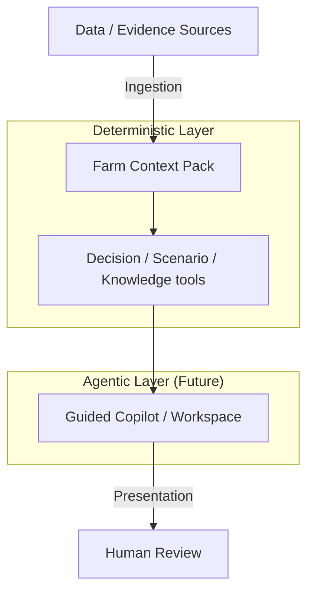

# AgroUnu Architecture Overview

## Core Principle

**One Farm Operating Picture (FOP), not disconnected modules.**

AgroUnu is designed to unify fragmented farm data into a single, structured context. Rather than treating finance, agronomy, and compliance as separate silos, the architecture routes all data through a central nervous system: the Farm Context Pack.

## High-Level Architecture

The system is designed as a deterministic shell that protects and structures the eventual probabilistic AI core.

## Farm Context Pack

The Farm Context Pack is the structured truth layer for the AI. It acts as the definitive state of the farm at any given moment, preventing LLM hallucination by forcing all generation to be grounded in this specific context.

**Included Domains:**
- Profile & Organization
- Parcels & Rotations
- Products & Master Data
- Applications (Inputs)
- Harvests & Output
- Field Observations (Scouting)
- Water & Workability
- Compliance & Obligations
- Operations & Farm Work Plan
- Soil & Nutrients
- Storage & Sales
- Market Signals
- Cash-Flow Resilience
- Trusted Knowledge
- Scenario Sandboxing
- Regional & Cooperative Intelligence
- Trust & Permissions

## Tool-Based AI Direction

The AI operating within AgroUnu should not scrape screens, guess at data, or rely on its pre-training for farm-specific facts. It is being architected to call structured, deterministic tools. The frontend UI and the AI agent share the exact same underlying tool gateway (e.g., `getFarmContext`, `getProcurementReview`).

## Evidence-First Design

Every answer, signal, or data point surfaced in AgroUnu must know its provenance. The architecture demands:
- **Source:** Where did this come from? (e.g., APIA, Manual Input, Invoice).
- **Confidence:** How reliable is this data? (High/Medium/Low).
- **Missing Data:** What is required but absent?
- **Reviewer Role:** Who needs to verify this?
- **What NOT to conclude:** Explicit guardrails on interpretation.

## Human-in-the-Loop

AgroUnu is an augmentation tool, not an automation replacement. The architecture routes specific decisions to specialized human roles:
- **Farmer:** Strategic decisions, ultimate approval.
- **Agronomist:** Diagnoses, prescriptions, field planning.
- **Accountant:** Tax, compliance, official reporting.
- **Funding Adviser:** Grant eligibility and application.
- **Cooperative Coordinator:** Pooling and regional strategy.
- **Quality Adviser:** Certification and compliance verification.

## Safe Boundaries

The architecture enforces strict limits on what the system can output, blocking high-risk categories to protect the user and the platform:
- No Diagnoses
- No Prescriptions
- No Eligibility Guarantees
- No Contract Generation/Execution
- No Payment Triggering
- No Certification issuance
