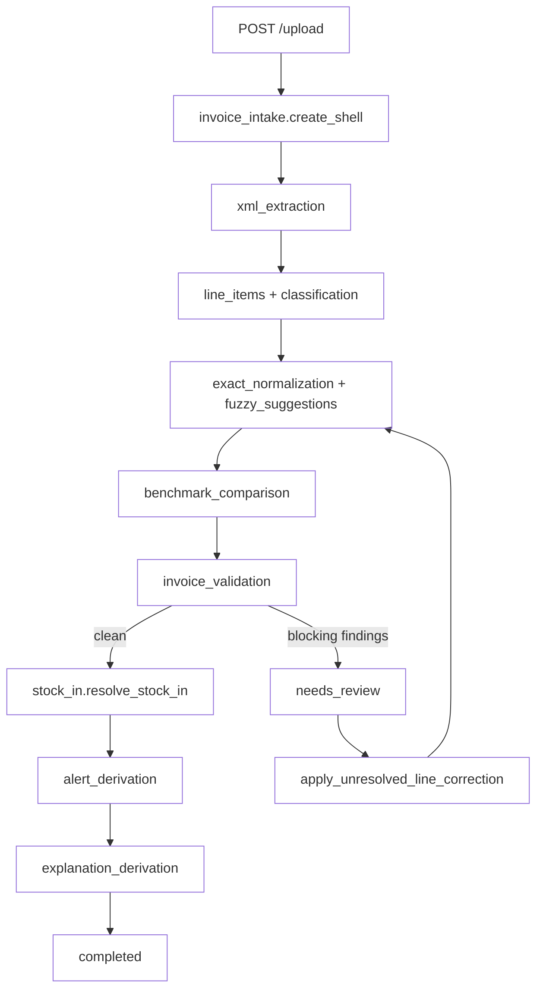
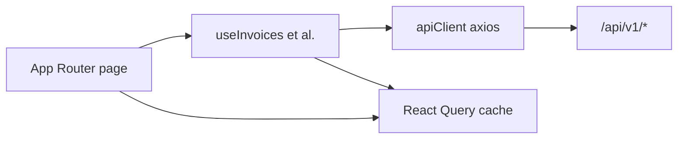

# Architecture (Detailed)

This file expands on [`ARCHITECTURE.md`](../ARCHITECTURE.md) at the repo root.
See also the original architecture notes in [`apps/api/docs/ARCHITECTURE.md`](../apps/api/docs/ARCHITECTURE.md).

---

## Code layout

```
apps/api/src/farm_copilot/
├── api/              FastAPI routes, request/response only
│   └── routes/       Per-resource handlers
├── contracts/        Pydantic DTOs at API boundaries
├── database/         SQLAlchemy 2.0 async models and queries
├── domain/           Pure functions, value objects, business rules
└── worker/           Pipeline orchestration, side-effecting steps

apps/web/src/
├── app/              Next.js App Router pages
├── components/       UI primitives + feature components
├── hooks/            TanStack Query data hooks
├── lib/api/          Axios client + service modules
├── lib/mock/         Mock data for feature gates (dev only in production)
├── stores/           Zustand stores
└── types/            Shared TS types and Zod schemas
```

---

## API surfaces

The backend exposes two surfaces:

| Surface | Prefix | Auth model | Purpose |
|---|---|---|---|
| HTML | `/`, `/login`, `/anaf/*` | Cookie session, redirect to `/login` on miss | Original Jinja2 templates (legacy) |
| JSON | `/api/v1/*` | Cookie session, returns 401 JSON on miss | Consumed by the Next.js SPA |

The Next.js app talks **only** to `/api/v1/*`. Both surfaces share the same
session cookie and the same auth helpers.

---

## Pipeline steps (canonical order)



Key invariants:

- **Stock-in writes only after** non-blocking validation.
- **Alerts always reference** pipeline events; never replace them.
- **Re-running** the pipeline for the same invoice is idempotent.
- **Corrections** re-enter the pipeline at the normalization step, not from upload.

---

## Authentication

Session-based via Starlette `SessionMiddleware`. The session cookie carries
`user_id`, `farm_id`, `farm_name`, `farm_cif`, `user_name`. There is no JWT.

In production the cookie must be set with:

- `domain=.iagricultura.ro` (so the Vercel-served frontend can include it on calls to `api.iagricultura.ro`)
- `samesite=lax`
- `secure=true`
- `httponly=true`

This is configured in [`apps/api/src/farm_copilot/api/app.py`](../apps/api/src/farm_copilot/api/app.py).

---

## Database

Postgres 16. Schema migrations live in `apps/api/migrations/versions/` and are
applied with Alembic. Production uses Supabase; dev uses a local Postgres
container from [`docker-compose.dev.yml`](../docker-compose.dev.yml).

Source-of-truth tables for the pipeline:

- `invoices` — header (cif, supplier, totals, status)
- `invoice_line_items` — extracted lines with normalization links
- `invoice_line_normalization` — chosen mapping + confidence + method
- `normalization_lookup` — exact alias index (farm + supplier + global)
- `invoice_line_classification` — line role (purchase, fee, transport, ...)
- `canonical_products` — global product catalog
- `product_aliases` — alias layers
- `benchmark_observations` — raw price observations
- `invoice_validations` — anomaly findings
- `stock_movements` — movement-based stock evolution
- `invoice_alerts` — user-facing alerts
- `invoice_explanations` — pipeline event log (audit)
- `line_corrections` — first-class correction history

Balance views are derived from `stock_movements`; the live API computes them on read.

---

## Frontend data flow



Hooks default to **strict mode** (real API only) when `NEXT_PUBLIC_STRICT_API=true`.
In dev, several hooks fall back to mock fixtures from `lib/mock/` if the API errors.
Production must always run with strict mode on.
